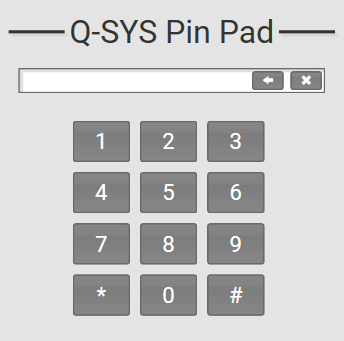

# Q-SYS Pin Pad

This is a very simple plugin that provides the user with a pin pad.

## How to Use

* Simply download the .qplug file and add it to your C:\Users\user\Documents\QSC\Q-Sys Designer\Plugins folder. 
* Drag into your schematic from the plugins section of your Schematic Elements. 
* Clicking on the digits buttons will append that text to the pin text field. You can expose any/all controls for use with other logic.

## How it Works

Each time a button is pressed, it simply appends the strings to the pin text field.

## Badges 
 
 

## Questions 
 For any questions, contact me at [maxxsanner105@gmail.com](mailto:maxxsanner105@gmail.com).
#### 

